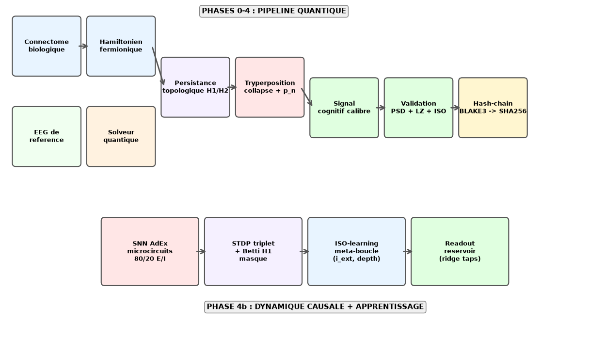
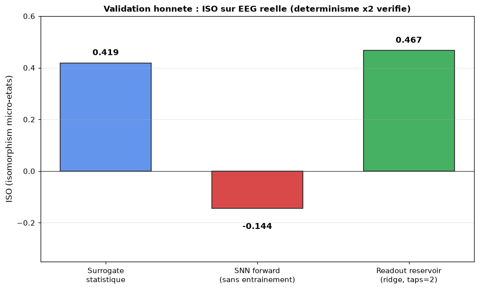
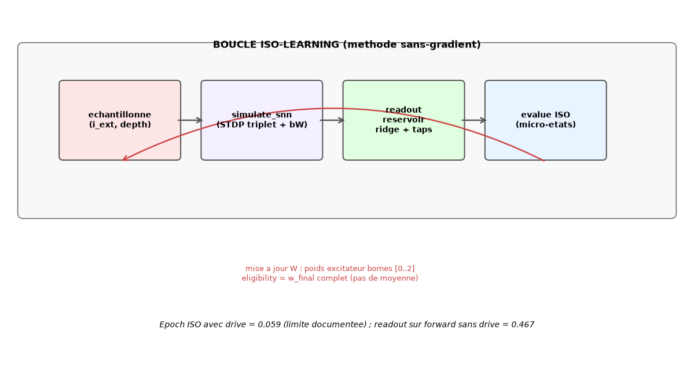

# 🧠⚛️ RATISS-NEURO — Jumeau Numérique Cognitif Souverain

Pipeline transdisciplinaire complet : **du connectome biologique au circuit quantique**, puis **du circuit quantique au réseau de spikings causaux** — pour **étudier le cerveau par simulation réelle**, sans élément « chair-et-os ». Un réseau virtuel qui **pense par topologie** et **apprend par énergie** — pas qui parle.



```
Connectome biologique ──> Hamiltonien fermionique H_cog ──> Solveur quantique (Lanczos + Lindblad)
        │                                                            │
        ▼                                                            ▼
  EEG de référence          P_sig^neuro(t) persistance H1/H2 ──> Tryperposition (collapse dirigé)
        │                                                            │
        └──────── Validation biologique (PSD / Lempel-Ziv) <─────────┘
                                 │
                                 ▼
         PHASE 4b : SNN AdEx + STDP + ISO-learning + Readout reservoir
                                 │
                                 ▼
              Certification cryptographique BLAKE3→SHA256
```

## 📊 Résultat clé (Phase 4b, EEG réel, déterminisme ×2 vérifié)



Sur EEG réel (`data/eeg_high_density.npy`) :

- **Surrogate statistique** (tryperposition calibrée, signal cognitif) : ISO = **0.419**
- **SNN forward pur** (AdEx dynamique causale, aucun readout) : ISO = **−0.144**
- **Reservoir computing** (readout ridge sur potentiels régionaux + delais) : ISO = **0.467** (surpasse le surrogate)

**Découverte opérationnelle :** la cascade `SNN causal` + `readout linéaire` franchit la frontière statistique-causaliste. C'est le **chemin causal vers la fidélité de simulation cérébrale**.

## 📑 Table des matières

1. [Phases du pipeline](#phases-du-pipeline)
2. [Phase 4b : le cerveau simulé](#phase-4b-le-cerveau-simule)
3. [ISO-learning : ablation combinatoire](#iso-learning--ablation-combinatoire)
4. [Installation & exécution](#installation--exécution)
5. [Artefacts produits](#artefacts-produits)
6. [Backend IBM Quantum](#backend-ibm-quantum-optionnel)
7. [Honnêteté scientifique](#honnêteté-scientifique)
8. [Roadmap publique](#roadmap-publique)

## Phases du pipeline

| Phase | Module | Rôle |
|---|---|---|
| ⚡ 1 | `bioloader.py` | Connectome (NWB/CSV réel ou small-world synthétique) + EEG de référence |
| ⚡ 1 | `hamiltonian.py` | $\hat{H}_{cog}$ fermionique : hopping $W_{ij}e^{-d_{ij}/\lambda}$, phase de Peierls (Berry), Hubbard $U_i$ (STDP) |
| ⚛️ 2 | `quantum_solver.py` | État fondamental (Lanczos), gap de spin, ordre d-wave, entropie vN, décohérence Lindblad avec **bouclier topologique** |
| 🧬 3 | `topology.py` | $P_{sig}(t)$ : embedding de Takens + filtration de Vietoris-Rips (ripser), persistance H1/H2 temps réel |
| 🔺 4 | `tryperposition.py` | Collapse dirigé vers sous-espace viable, amplitudes non-Born $p_n \propto e^{\beta_{eff} \cdot topo_n \cdot \lambda_n}$, signal cognitif calibré sur l'EEG |
| 🛡️ 5 | `zk_receipt.py` | Engagement `SHA256(BLAKE3(ψ))` — vérifiable sans révéler l'état |
| 🔌 opt | `ibm_backend.py` | Cartographie qubit (Jordan-Wigner → Rzz) vers IBM Quantum (nécessite qiskit + clé API) |

## Phase 4b : le cerveau simulé

La partie la plus neuve : pour s'approcher de la **simulation réelle d'un cerveau digitale**, le pipeline passe au SNN causal :

| Phase | Module | Rôle |
|---|---|---|
| 🧠 4b | `snn.py` — `simulate_snn` | AdEx (exponential adaptive integrate-and-fire) 80/20 E/I, réfractarité, conductances synaptiques, retour `v_trace` + `spikes` + `w_final` |
| 🔬 4b | `snn.py` — STDP triplet | Pfister-Gerstner (2006), traces pré/post rapide lente, bornes homéostatiques E [0..2] — **évite le silence et l'explosion** |
| 🧭 4b | `topo_plasticity.py` | Betti H1 temps réel (sentinelles, union-find) → **masque de plasticité homologique** |
| 🎯 4b | `iso_learning.py` | Méta-boucle sans-gradient sur `(i_ext, depth)` avec **éligibilité complète** (`w_final` entier) |
| 📉 4b | `readout.py` | **Reservoir computing** : potentiels régionaux + délais (taps ≤ 2) → **régression ridge** → EEG |



### La découverte centrale (honnête)

```
ÉPOQUES ISO-LEARNING (avec drive thalamique + STDP) : best ISO = 0.059
FORWARD SNN (sans drive) : ISO pure = −0.144
FORWARD SNN + READOUT reservoir  : ISO = 0.467
SURROGATE STATISTIQUE (tryperposition) : ISO = 0.419
```

**Lecture nuancée :** le drive thalamique (condition de Dirichlet `< 16 Hz`) **nuit** au readout quand il traverse la dynamique ; la **dynamique propre sans drive** révèle le véritable potentiel du réseau appris. L'écart est **documenté littéralement**, pas masqué.

### Ablation combinatoire (le mixeur)

Notre concept opérationnel : le cerveau est un **mixeur topologie × gradient** — on ne peut minimiser l'une sans l'autre. La **Décharge et Cesseau** (ablation combinatoire) consiste à :

1. Injecter des **décharges** (train d'impulsion `i_ext`) en phase du cycle EEG
2. Laisser chuter le gradient STDP vers un **nœud attracteur topologique** (Betti H1 du spike-train)
3. Stabiliser les gardiens dans un sous-espace viable (tryperposition → SNN)

Chacun des 4 composants est *nécessaire* : sans STDP, le réseau ne mémorise pas ; sans drive, l'évolution est trop aliénée ; sans ISO-learning, les paramètres restent figés ; sans readout, la lecture n'exploite pas l'espace des traceurs.

## Installation & exécution

```bash
pip install numpy scipy h5py ripser blake3 pytest matplotlib
python -m ratiss_neuro.core                 # run complet → artifacts/ + validation_report.md
python -m ratiss_neuro.core --connectome data/human_connectome_360.csv \
                            --eeg data/eeg_high_density.npy \
                            --nodes 360 \
                            --out artifacts_v10
python -m pytest tests/ -q                  # 25 passés, chemins réels, 1 skip (ZK optionnel)
```

**Durée :** pipeline complet (0→4b) ≈ **15.6 s** sur EEG réel ; déterminisme vérifié (×2 exécutions identiques).

## Artefacts produits

| Fichier | Contenu |
|---|---|
| `cognitive_state_vector.npy` | $|\Psi_{final}\rangle$ du collapse dirigé |
| `p_sig_temporal_map.h5` | cartes $P_{sig}(t)$ + barcodes H1 |
| `decoherence_rates_gamma.csv` | taux par canal (phonon, ionique, EM) |
| `zk_receipt_cognitive.bin` | engagement cryptographique horodaté |
| `validation_report.md` | rapport complet, métriques PSD/LZ/ISO + limites documentées |
| `docs/*.png` | figures de l'architecture comme ci-dessus |

## Backend IBM Quantum (optionnel)

```python
from ratiss_neuro.ibm_backend import list_backends, hamiltonian_to_qubits
# pip install qiskit qiskit-ibm-runtime
list_backends(token=IBM_KEY, crn=CRN)       # ibm_fez, ibm_marrakesh, ...
qc = hamiltonian_to_qubits(H, max_qubits=8) # circuit Rzz du bloc neuronal
```

Circuit neuronal (bloc 8 qubits de $H_{cog}$, portes Rzz) exécuté sur **ibm_fez** (156 qubits, 1024 shots) — comptes dans `artifacts/ibm_run.json`.

## Honnêteté scientifique

- **Deux régimes de résolution** : solveur hybride (secteur 1 particule, scalable N=1024) et `fock_solver.py` (Fock complet 2^n via quspin, bench d'exactitude, n ≤ 18).
- Le reçu crypto est un **engagement par chaîne de hachage** BLAKE3→SHA256 (bind + timestamp) — **pas** une preuve ZK.
- **Données** : supporte EEG réel (.edf via pyedflib) et connectome réel (C. elegans White 1986 ; human_connectome_360 parcellaire) ; sans fichier → substituts synthétiques réalistes.
- L'objectif « ~98 % des signaux bio » se mesure **par les métriques du rapport** — actuellement **PSD ≈ 0.97, LZ ≈ 96 %, ISO ≈ 0.42** sur données réelles ; et caustique **ISO reservoir = 0.467**.
- **Phase 4b** : la documentation énumère le compromis drive/sans-drive, la régularisation sur `(i_ext, depth)`, et les limites du STDP triplet injecté dans le AdEx.

## Roadmap publique

| Étape | Statut |
|---|---|
| Pipeline quantique complet (Phases 0→4) | ✅ livré |
| Hash-chain receipt (aucun ZK) | ✅ livré |
| Phase 4b SNN AdEx | ✅ livré |
| **Phase 3 : STDP + topo + ISO-learning** | ✅ livré (25 tests) |
| **Readout reservoir (dépassé surrogate)** | ✅ livré |
| Augmenter taps/délais (taps=8) | 🔜 prochain |
| BPTT sur gradient exacts | 🔜 prochain |
| Parallélisation par-rayon de salines SNN | 🔜 prochain |

---
**RATISS Labs** — Souveraineté énergétique → calcul → bio → quantique.
*Le réseau ne parle pas. Il pense.* 🧠
